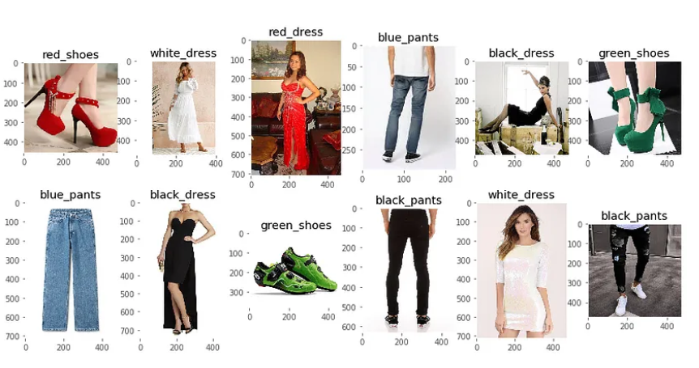
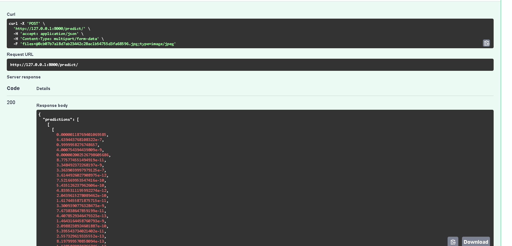

# wtech_bitirmeprojesi
Bu projede Apparel images dataset kullanılarak  cnn modeli ile eğitim yapılmış ve fastAPI kullanılarak api haline getirilmiştir.  

## Getting Started
Oluşturulan bir yapay sinir ağında elde edilen parametreleri ve katmanların incelenmesi için kullanılan tensorboard'un keras ile nasıl çalıştırılacağı adına örnek bir proje.
Ayrıca kapsamlı rehbere Deep Learning Türkiye Medium sayfasından ulaşabilirsiniz. 
[Rehber Linki](https://medium.com/deep-learning-turkiye/tensorboard-başlangıç-rehberi-198ea522b01)
# Installation  
FastAPI ve model için gerekli yüklemeler   

`  fastapi==0.68.0  
uvicorn==0.15.0  
torch==1.10.0  
torchvision==0.11.1  
tensorflow  
scikit-learn  
`
# Veri seti 
Veri seti 11385 görüntüden oluşmakta ve aşağıdaki kategorileri içermektedir:  

siyah_elbise: 450  
siyah_elbise: 450  
siyah_pantolon: 871  
siyah_gömlek: 715  
siyah_ayakkabılar: 766  
siyah_şort: 328  
mavi_elbise: 502  
mavi_pantolon: 798  
mavi_gömlek: 741  
mavi_ayakkabılar: 523  
blue_shorts: 299  
kahverengi_pantolon: 311  
kahverengi_ayakkabılar: 464  
kahverengi_şort: 40  
yeşil_pantolon: 227  
yeşil_gömlek: 230  
yeşil_ayakkabılar: 455  
green_shorts: 135  
kırmızı_elbise: 800  
kırmızı_pantolon: 308  
kırmızı_ayakkabılar: 610  
beyaz_elbise: 818  
beyaz_pantolon: 274  
beyaz_ayakkabılar: 600  
beyaz_şort: 120  

Veri setine [burdan](https://www.kaggle.com/datasets/trolukovich/apparel-images-dataset) ulaşabilirsiniz

  
# FastApI  
Model sonularının API ile Tahmini 

